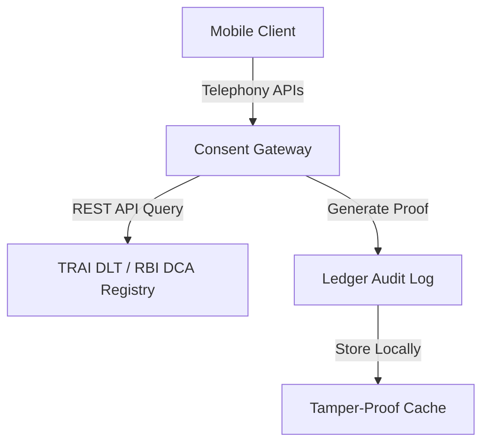

# Compliance Forensics Engine
> **Real-Time Consent Verification for Scam Prevention**

Compliance Forensics Engine is a privacy-first, on-device consent validation platform designed to combat the rising tide of digital fraud and caller ID spoofing in India. By integrating real-time checks against centralized regulatory consent registries, the engine verifies the legitimacy of incoming calls and commercial messages before they reach the user.

---

## 🏗️ On-Device Architecture



1. **Mobile Client**: Monitors incoming calls using Google's privacy-first `IncomingCallRetriever` API, keeping call processing restricted strictly to device memory.
2. **Consent Gateway**: Performs instant REST queries to central TRAI DLT gateways to authenticate caller headers and current consent states via RBI DCA endpoints.
3. **Ledger Audit Log**: Produces an on-device, tamper-proof proof of legitimacy by hashing and committing data locally:
   $$P_{\text{audit}} = \text{Hash}(\text{ID}_{\text{caller}} \mathbin{\Vert} \text{Consent} \mathbin{\Vert} t)$$

---

## 🛠️ Stack & Technical Specs

- **Language**: Kotlin
- **Min SDK**: 26 (Android 8.0) / **Target SDK**: 34
- **Build**: Gradle (Kotlin DSL)
- **UI**: XML layouts + View Binding + Material Components
- **Networking**: Retrofit + OkHttp (mock DLT registry endpoint for hackathon scope)
- **Storage**: SQLiteOpenHelper (local consent cache + audit log)
- **Testing**: JUnit + Espresso

---

## 👥 Team Novaris & Module Ownership

| Module | Owner | Description / Responsibilities | Files |
|---|---|---|---|
| **UI** | Kirutick Siddhesh | Person 1 (Team Lead / UI Developer) - Renders the incoming-call verification card, displays states. | `MainActivity.kt`, `res/layout/`, `res/values/` |
| **Call Detection** | Dhivyesh P | Person 2 - Listens for incoming caller number before the phone rings. | `CallReceiver.kt` |
| **Database & Verification** | **Sham S** | Person 3 (Database Developer) - Owns local SQLite cache, mock DLT registry lookup logic via Retrofit, and core verification. | `data/DatabaseHelper.kt`, `data/DltRegistryApi.kt`, `data/ConsentRepository.kt`, `data/ConsentModels.kt` |
| **Audit & Integration** | Yashaswini Srinivasan | Person 4 - Produces a tamper-proof audit log of each verification event. | `AuditLogger.kt`, instrumented tests |

---

## 🛠️ Tech Flow (Database & Verification)

```mermaid
sequenceDiagram
    participant App as Mobile App
    participant DB as DatabaseHelper (SQLite)
    participant GW as Mock DLT Registry (Retrofit)
    
    App->>DB: Query cached consent for header
    alt Cache Hit
        DB-->>App: Return consent status
    alt Cache Miss
        App->>GW: Fetch registration details
        GW-->>App: Return DLT validation
        App->>DB: Write to Local Cache
    end
    App->>App: Match caller header + consent
    App-->>App: Generate Verified/Unverified Result
```

---

## 🚀 Getting Started

1. Open this folder in **Android Studio** (Koala+ recommended) — it will auto-generate the `gradlew` wrapper scripts and sync dependencies.
   If you're on the command line instead, run `gradle wrapper` once inside this folder to generate `gradlew`/`gradlew.bat`.
2. Sync Gradle.
3. Run on an emulator or device with API 26+.

---

## 📝 Notes

- `DltRegistryApi.BASE_URL` currently points at a mock endpoint. Swapping in the real TRAI DLT gateway URL is the first roadmap item once credentials are available.
- No call audio or voice biometrics are ever processed — only caller metadata (number, claimed entity, consent ID), per the privacy commitments in the pitch deck.
