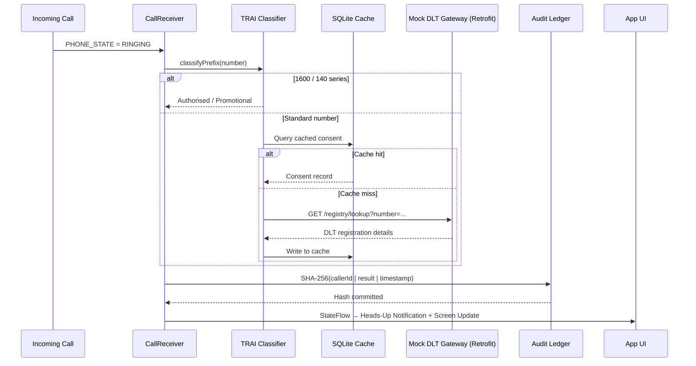

# Compliance Forensics Engine
> **Real-Time Caller Consent Verification — Built for India's Regulatory Stack**

---

## Submission Details

| Field | Details |
|-------|---------|
| **Hackathon** | InnovaHack Chapter 1 — National Level Hackathon |
| **Organised by** | Elite Forums, powered by Unstop |
| **Round** | Round 1 (Online) — 25 July 2026, 10:00 AM → 26 July 2026, 10:00 AM IST |
| **Team Name** | Team Novaris |
| **Team Leader** | Dhivyesh P |
| **Team Members** | Dhivyesh P · Sham S · Kirutick Siddhesh · Yashaswini Srinivasan Mahalakshmi |
| **Selected Track** | Domain 5 — Startup / Open Innovation |
| **Problem Statement** | Privacy-first real-time caller consent verification using TRAI's regulatory numbering framework to prevent financial fraud and caller ID spoofing |

---

## The Problem

India loses billions of rupees every year to financial fraud that starts with a single phone call. A caller claims to be from your bank, says your account is compromised, and you comply — because you have no way to verify, in the moment a call arrives, whether the caller actually has your consent to contact you under TRAI's regulatory framework.

Existing apps tell you who is calling. **We tell you whether they are legally authorised to.**

---

## What Compliance Forensics Engine Does

CFE is a privacy-first, on-device consent validation platform that runs the moment your phone rings:

1. **Reads the incoming number** via Android's Telephony APIs — no data leaves the device during this step.
2. **Applies TRAI Series Heuristics** — instantly classifies the number based on TRAI's TCCCPR framework: `1600` series numbers are from SEBI/RBI/IRDAI/PFRDA-regulated entities and government bodies; `140` series are registered promotional callers; everything else falls through to local history analysis.
3. **Cross-references the local consent cache** — a SQLite-backed registry of verified DLT entities, queried offline-first for speed, refreshed via mock DLT/RBI DCA REST endpoints.
4. **Generates a tamper-evident audit proof** — every verification outcome is SHA-256 hashed and committed to an on-device ledger before the user sees the result.
5. **Surfaces a real-time verdict** — a heads-up notification and in-app overlay appear within milliseconds of the call being detected, colour-coded by consent status.

---

## Architecture

### On-Device Pipeline

```
Incoming Call
     │
     ▼
┌─────────────────────────────────────────────────────┐
│              CallReceiver (BroadcastReceiver)        │
│  Reads EXTRA_INCOMING_NUMBER from telephony intent   │
└──────────────────────┬──────────────────────────────┘
                       │
                       ▼
┌─────────────────────────────────────────────────────┐
│            TRAI Heuristic Classifier                 │
│  1600* → Authorised Bank/Govt                        │
│  140*  → Promotional/Telemarketing                   │
│  Other → Local call-log lookup → Known / Unverified  │
└──────────────────────┬──────────────────────────────┘
                       │
                       ▼
┌─────────────────────────────────────────────────────┐
│           ConsentRegistryRepository                  │
│  SQLite cache (offline-first)                        │
│  Retrofit fallback → Mock DLT REST endpoint          │
└──────────────────────┬──────────────────────────────┘
                       │
                       ▼
┌─────────────────────────────────────────────────────┐
│            AuditLoggerRepository                     │
│  P_audit = SHA-256(callerId ‖ consentStatus ‖ t)     │
│  Written to Firestore `audit_ledger` (append-only)   │
└──────────────────────┬──────────────────────────────┘
                       │
                       ▼
┌─────────────────────────────────────────────────────┐
│           CallVerificationViewModel                  │
│  StateFlow<CallUiState> → UI / Notification          │
└─────────────────────────────────────────────────────┘
```

### Verification Sequence



### State Machine

```
IDLE ──► CHECKING ──► AUTHORISED_BANK_GOVT   (🟢 1600 series)
                  ├──► PROMOTIONAL            (🟡 140 series)
                  ├──► KNOWN                  (🟢 in call history)
                  ├──► UNVERIFIED             (🟡 first-time caller)
                  └──► SUSPICIOUS             (🔴 in reports ledger)
```

---

## TRAI Regulatory Basis

This is not a spam-list app — the classification logic is grounded in a real regulatory framework:

| Series | TRAI Classification | Entities Permitted |
|--------|--------------------|--------------------|
| `1600xxxxxx` | Service / Transactional | RBI, SEBI, IRDAI, PFRDA regulated entities + Govt-to-Citizen |
| `140xxxxxxx` | Promotional / Telemarketing | Any TRAI-registered commercial entity |
| `+91 10-digit` | Standard / Unclassified | Personal, business, unregistered |

TRAI's TCCCPR framework explicitly prohibits third-party apps from tagging or blocking `1600` or `140` series calls as spam — CFE respects this: those series are only ever positively labelled, never flagged.

---

## Tech Stack

| Layer | Technology |
|-------|-----------|
| Language | Kotlin |
| Architecture | MVVM + Repository Pattern |
| Async | Kotlin Coroutines + StateFlow |
| Local Database | SQLite (SQLiteOpenHelper) + Room (blocklist) |
| Network | Retrofit + OkHttp (mock DLT REST endpoints) |
| Auth | Firebase Phone Auth (OTP) |
| Cloud Ledger | Firebase Firestore (`audit_ledger`, append-only) |
| Notifications | Android NotificationChannel (IMPORTANCE_HIGH) |
| Build | Gradle (Kotlin DSL) |

---

## Project Structure

```
app/src/main/java/com/team/complianceforensics/
├── call/
│   ├── CallReceiver.kt          ← BroadcastReceiver, feeds CallEventBus
│   └── CallEventBus.kt          ← SharedFlow bridge (Receiver → ViewModel)
├── data/
│   ├── auth/
│   │   └── AuthRepository.kt    ← Firebase Phone OTP wrapper
│   ├── classification/
│   │   └── TraiClassifier.kt    ← Pure prefix logic, no I/O
│   ├── consent/
│   │   ├── ConsentRegistryRepository.kt
│   │   └── DatabaseHelper.kt    ← SQLite consent cache
│   ├── calllog/
│   │   └── CallHistoryRepository.kt  ← CallLog.Calls lookup
│   ├── audit/
│   │   └── AuditLoggerRepository.kt  ← SHA-256 + Firestore write
│   ├── block/
│   │   └── BlockedNumberRepository.kt ← Room DB, explicit user blocks only
│   ├── stats/
│   │   └── StatsRepository.kt   ← Atomic Firestore counters
│   ├── activity/
│   │   └── ActivityFeedRepository.kt ← audit_ledger feed
│   └── report/
│       └── ReportRepository.kt  ← RPT-YYYY-NNNNN generation
├── ui/
│   ├── auth/
│   │   └── AuthViewModel.kt
│   ├── call/
│   │   └── CallVerificationViewModel.kt
│   └── home/
│       └── HomeViewModel.kt
└── ComplianceForensicsApp.kt    ← Application class, DI root
```

---

## Team

| Name | Role | Owns |
|------|------|------|
| **Dhivyesh P** | Consent Verification & Integration | `CallReceiver`, `CallEventBus`, `ConsentRegistryRepository`, `CallVerificationViewModel` |
| **Sham S** | Database Developer | `DatabaseHelper` (SQLite cache), Retrofit/OkHttp mock DLT client, core verification matching logic |
| **Kirutick Siddhesh** | Mobile UI & Client Developer | All Composables/Activities, navigation, notification UI, home dashboard |
| **Yashaswini Srinivasan Mahalakshmi** | Ledger & Audit Log | `AuditLoggerRepository`, Firestore `audit_ledger`, `ReportRepository`, `StatsRepository` |

---

## Hackathon Scope — InnovaHack Chapter 1

Built in 24 hours for Domain 5: Open Innovation.

**What's in the demo:**
- Live TRAI prefix classification on simulated incoming calls (demo mode: "Simulate Call" button exercises the full pipeline without a real call — reliable in front of judges)
- SQLite-backed consent cache pre-seeded with 10 registered entities
- Firestore audit ledger with real SHA-256 hashes, viewable in-app
- Firebase Phone Auth (OTP via test numbers — no SMS cost, no carrier dependency)
- Home dashboard: live stats cards, recent activity feed, Quick Verify bar
- Explicit user-controlled number blocking (Room DB — never auto-blocks)

**What's mocked vs. real:**
| Component | Status | Notes |
|-----------|--------|-------|
| TRAI 1600/140 prefix rules | ✅ Real | Directly from TCCCPR framework |
| SHA-256 audit hashing | ✅ Real | Verifiable in Firestore console |
| Firebase Auth | ✅ Real | Test phone numbers pre-registered |
| DLT registry lookup | 🟡 Simulated | Retrofit client hits a mock endpoint; real DLT API access requires telecom operator agreement |
| Entity sub-code mapping | 🟡 Simulated | No public TRAI table maps sub-codes to specific bank names; this would be a registry-partnership integration |

---

## Submission Checklist (Team Leader — Dhivyesh P)

> Submit via **https://forms.gle/J41yUTNsgbBUHhk37** — one submission only, well before 26 July 2026, 10:00 AM IST.

- [ ] Deployed URL of the project uploaded in the form
- [ ] Google Drive link added to the form, set to **"Anyone with the link can view"**
- [ ] Drive folder contains: Presentation (PPT, 6–7 slides, no template required)
- [ ] Drive folder contains: Optional 5-minute explanatory demo video
- [ ] Submission form states: Team Name (Team Novaris), Team Leader (Dhivyesh P), all member names, Selected Track (Domain 5 — Open Innovation)
- [ ] Only one submission made, by the Team Leader
- [ ] All Drive files verified as accessible before submitting

---

*Built with Kotlin · Firebase · TRAI TCCCPR framework · InnovaHack Chapter 1 · 2026*
